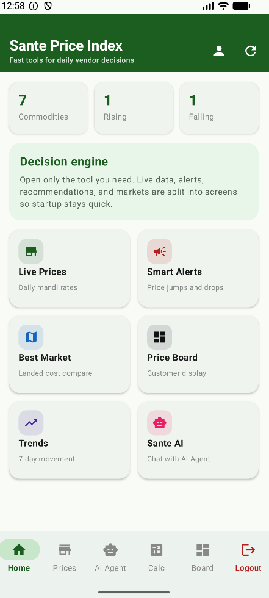
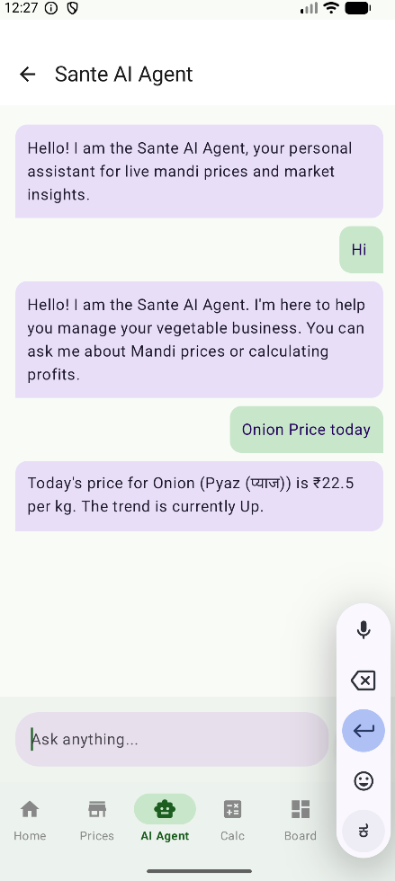
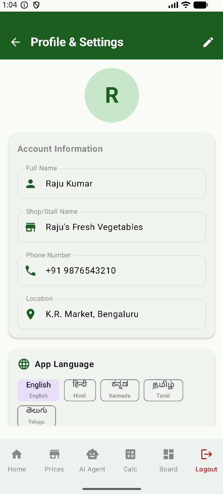

# Sante Price Index 🛒📈

Sante Price Index is a comprehensive intelligence tool designed for fresh-market vendors and retailers to make data-driven decisions. It provides live mandi prices, profit calculations, inventory management, and an integrated AI assistant to optimize daily business operations.

## 🚀 Key Features

*   **Live Mandi Prices**: Real-time tracking of commodity prices across various mandis.
*   **Sante AI Agent**: An intelligent assistant that understands multi-language queries (English, Hindi, Kannada, etc.) and provides instant price lookups (e.g., "erulli yestu").
*   **Profit Optimizer**: Calculate landed costs, transport expenses, and wastage to find the best market for your produce.
*   **Digital Price Board**: A professional customer-facing display for your daily prices.
*   **Inventory Management**: Track stock levels, buying prices, and estimated profit margins.
*   **Smart Alerts**: Instant notifications on significant price jumps or drops.
*   **Market Trends**: 7-day price movement visualization to predict future market behavior.

## 📱 Screenshots

<p align="center">
  
  
  
  
  
  
</p>
<p align="center">
  
  
  
  

</p>

## 🛠 Tech Stack

*   **Language**: Kotlin
*   **UI Framework**: Jetpack Compose (Modern Declarative UI)
*   **Architecture**: MVVM (Model-View-ViewModel)
*   **Authentication**: Firebase Auth (including Google Sign-In)
*   **Database**: Firebase Realtime Database
*   **AI Engine**: Custom Local Intelligence (Multi-language support)
*   **Navigation**: Jetpack Compose Navigation
*   **Local Storage**: DataStore Preferences

## 📦 Setup & Installation

1.  **Clone the repository**:
    ```bash
    git clone https://github.com/Hemanthkumar25s/Sante_Price_index.git
    ```
2.  **Firebase Configuration**:
    *   Add your `google-services.json` to the `app/` directory.
    *   Enable Email/Password and Google Sign-In in the Firebase Console.
3.  **Google Sign-In**:
    *   Update the `default_web_client_id` in `res/values/strings.xml` with your Web Client ID from the Firebase Console.
4.  **Build and Run**:
    *   Open the project in Android Studio.
    *   Sync Gradle and run the `:app` module.

## 🤝 Contribution

Contributions are welcome! Please feel free to submit a Pull Request.

---
*Developed for efficient and smart vegetable trading.*
