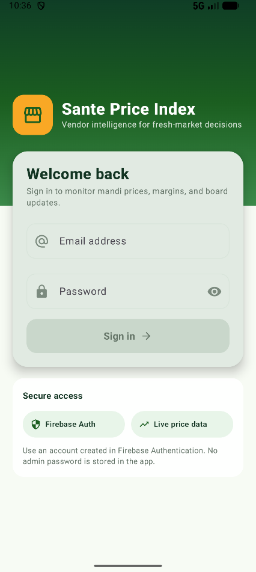
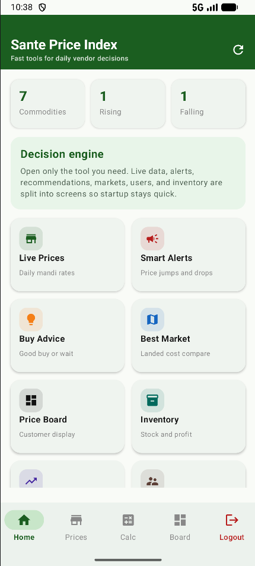
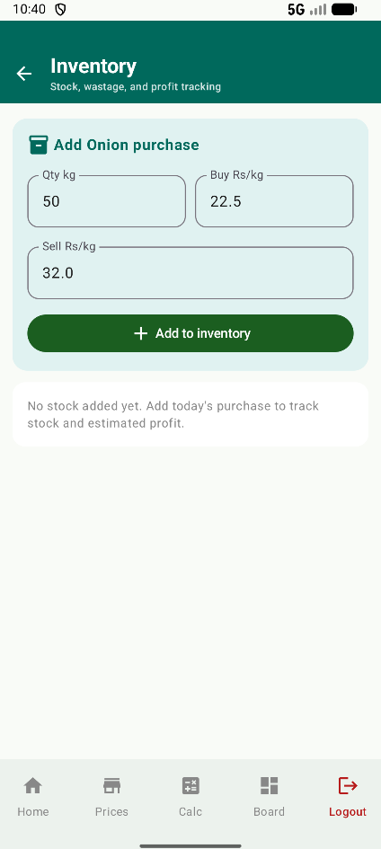
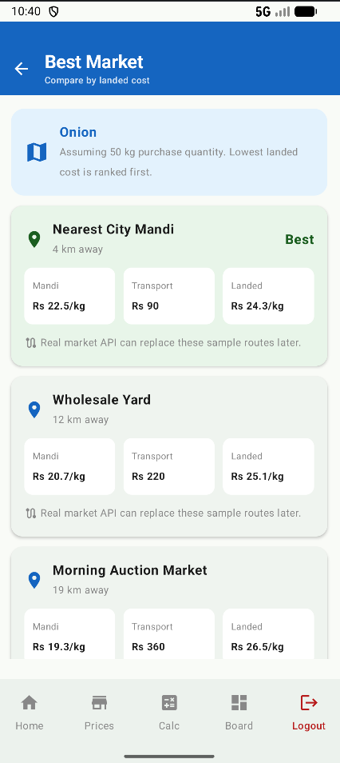
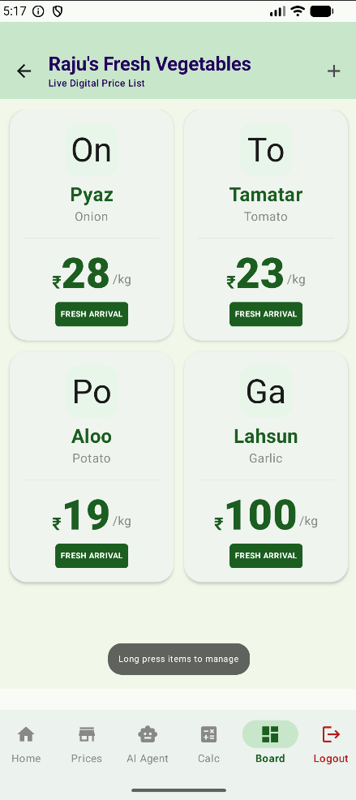
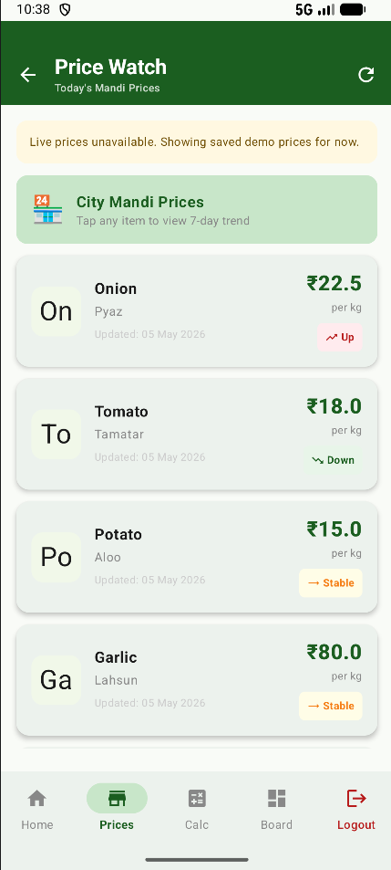
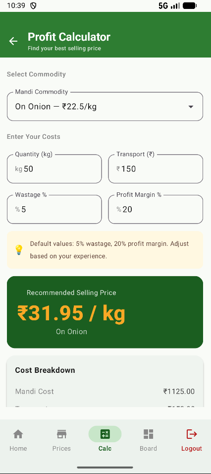
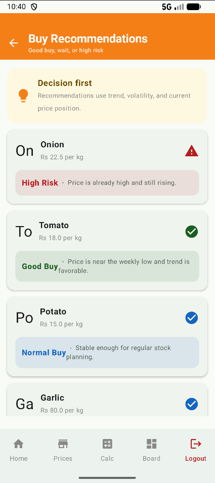
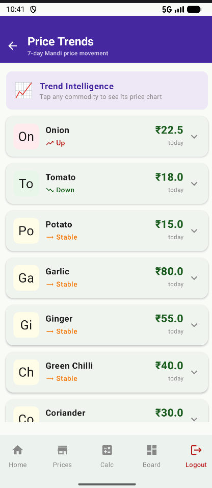
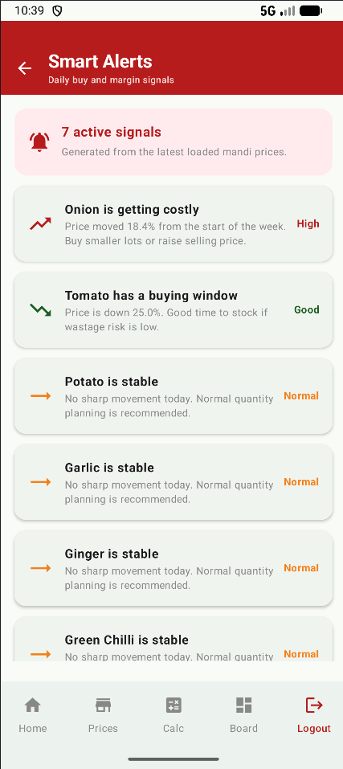

# Sante Price Index 📈

Sante Price Index is a comprehensive vendor intelligence platform designed to empower sellers with real-time market data. It provides insights into Mandi prices, profit margins, and inventory management to facilitate data-driven fresh-market decisions.

## ✨ Features

- **Live Mandi Prices:** Real-time tracking of commodity prices across various markets.
- **Profit Calculator:** Calculate potential margins and analyze pricing strategies.
- **Market Trends:** Visual analytics to understand price fluctuations over time.
- **Price Watch & Alerts:** Set up custom notifications for price drops or spikes.
- **Inventory Management:** Keep track of stock levels in sync with market value.
- **Recommendation Engine:** Smart suggestions based on current market dynamics.
- **Secure Access:** Enterprise-grade security using Firebase Authentication.

## 🛠 Tech Stack

- **Language:** [Kotlin](https://kotlinlang.org/)
- **UI Framework:** [Jetpack Compose](https://developer.android.com/jetpack/compose) (Material 3)
- **Backend:** [Firebase](https://firebase.google.com/) (Authentication, Realtime Database)
- **Architecture:** MVVM (Model-View-ViewModel)
- **Concurrency:** Kotlin Coroutines & Flow
- **Navigation:** Compose Navigation

## 🚀 Getting Started

### Prerequisites

- Android Studio Iguana (or newer)
- JDK 17
- Firebase Project (for Authentication and Database)

### Installation

1. **Clone the repository:**
   ```bash
   git clone https://github.com/Hemanthkumar25s/Sante_Price_index.git
   ```

2. **Add Firebase configuration:**
   - Place your `google-services.json` file in the `app/` directory.

3. **Build and Run:**
   - Open the project in Android Studio.
   - Sync project with Gradle files.
   - Click 'Run' to deploy on an emulator or physical device.

## 📱 Screenshots

<p align="center">
   
   
   
   
   
   
   
   
   
   
   
</p>

## 📄 License

This project is licensed under the MIT License - see the [LICENSE](LICENSE) file for details.

---
Built with ❤️ for the vendor community.
